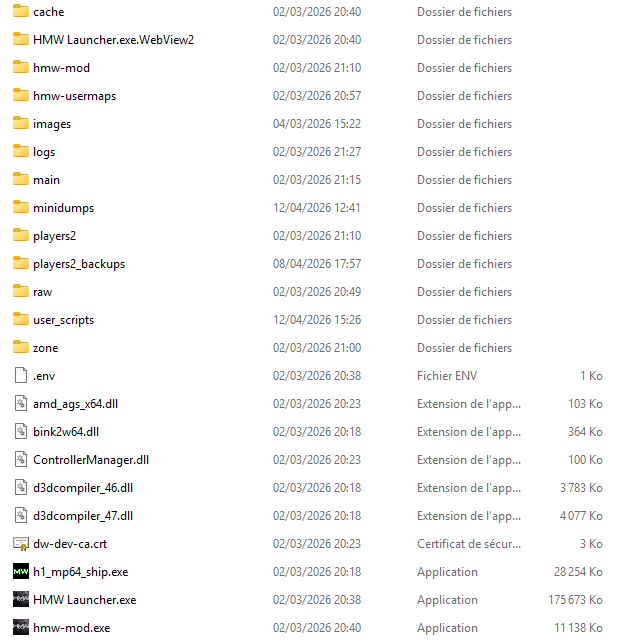
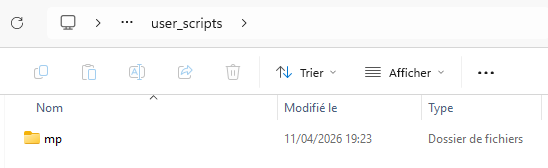

# 🎮 Kayzer Mods

> Collection de mods GSC standalone pour **HMW (Horizon Mod Warfare)** — conçus pour une utilisation en serveur privé ou en local.

---

## ⚙️ Prérequis

Avant d'installer les Kayzer Mods, tu dois avoir **HMW (Horizon Mod Warfare)** installé et fonctionnel.

Tout est expliqué ici (installation du jeu + du mod) : https://discord.gg/5UtEFzNjK3

---

## 📁 Installation

### 1. Localise le dossier racine de HMW

Rends-toi dans le dossier d'installation de HMW. Tu devrais y trouver une structure similaire à celle-ci :



### 2. Crée le dossier `user_scripts` si besoin

Si le dossier `user_scripts` n'existe pas encore à la racine, crée-le manuellement.

### 3. Dépose le fichier `.gsc` dans le bon dossier

Si le dossier `mp` n'existe pas encore dans `user_scripts`, crée-le manuellement.

Place ensuite le fichier `.gsc` du mod que tu veux utiliser dans `user_scripts/mp/` :



La structure finale doit ressembler à ceci :

```
HMW/
└── user_scripts/
    └── mp/
        └── exemple.gsc
```

Chaque mod est un fichier `.gsc` indépendant — tu peux en activer plusieurs à la fois en plaçant plusieurs fichiers dans ce dossier.

---

## 📦 Mods disponibles

| Mod | Fichier | Description |
|---|---|---|
| No Block | `no_block.gsc` | Supprime la collision entre les joueurs — plus de blocage face à un allié ou un ennemi |
| Specialist MW3 | `specialist_MW3/specialist_MW3.gsc` | Mode Spécialiste — atouts débloqués progressivement par palier de kills |
| Specialist MW3 Streaks | `specialist_MW3/specialist_MW3_streaks.gsc` | Mode Spécialiste complet — atouts + killstreaks + nuke à 25 kills |

---

## ⚠️ Disclaimer

Les Kayzer Mods sont destinés exclusivement à une utilisation en serveur privé ou en local. L'utilisation de ces mods sur des serveurs publics est strictement déconseillée. L'auteur ne pourra en aucun cas être tenu responsable des sanctions, bans ou conséquences résultant d'une mauvaise utilisation de ces outils.

---

## 💬 Support

Pour tout retour ou suggestion, rejoins le Discord et rends-toi dans le canal dédié au Kayzer Mods :

https://discord.gg/MAx7vaeSfJ
